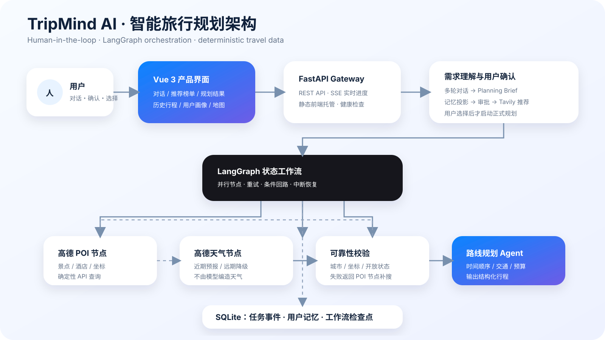

# TripMind AI

> 多智能体智能旅行规划平台 · 个人实习项目  
> 设计与开发：陈稳畅

TripMind AI 是一个面向真实旅行场景的智能规划应用。用户先通过自然语言对话说明目的地、日期和旅行偏好，需求 Agent 会逐轮澄清并生成结构化 Planning Brief；用户明确确认后，系统才组织多个专业 Agent 协作完成景点检索、天气查询、住宿推荐和日程编排，并在可交互地图中展示完整路线。



完整架构说明见 [docs/architecture.md](docs/architecture.md)。

### 项目演示

#### 中文旁白详细演示（可直接在线播放）

https://github.com/user-attachments/assets/3bb11e06-715a-4d06-b9e4-eec65e7dce20

[打开视频 Issue](https://github.com/cccccwwc/tripmind-ai/issues/1) · [观看 20 秒快速预览](docs/demo/tripmind-demo.mp4) · [下载详细演示](docs/demo/tripmind-demo-detailed.mp4)

## 项目亮点

- **LangGraph 多智能体协作**：景点、天气、酒店三个节点并行执行，汇合校验后再交给行程节点。
- **可恢复工作流**：节点失败自动重试和降级，景点不足或坐标不通过会回到检索节点；SQLite checkpoint 支持审批、中断与重启恢复。
- **后台任务与实时进度**：规划请求立即返回 `job_id`，耗时工作在线程池中执行；SSE 推送持久化节点事件，支持取消、重试、断线重连和从检查点继续。
- **对话式需求澄清**：多轮理解自然语言，持续合并目的地、日期、交通、住宿与偏好，形成可确认的 Planning Brief。
- **显式启动门槛**：Brief 未补齐、未由用户点击确认时，不触发推荐检索或正式规划 Agent。
- **旅行记忆投影**：在 Brief 中展示当前城市已去地点及上次未完成地点，避免重复并支持续排。
- **可追溯长期记忆**：归档对话后提取偏好与避雷候选，保存原话证据和消息来源；用户审批后才生效，并支持编辑、忘记与单次旅行临时覆盖。
- **真实工具调用**：通过 MCP 协议连接高德地图服务，获取 POI、天气和坐标数据。
- **实时推荐榜单**：使用 Tavily 聚合公开旅行攻略，保留来源证据，用户勾选后再生成行程。
- **结构化行程生成**：把模型输出转换为稳定的数据结构，支持前端分区展示与编辑。
- **地图路线可视化**：同时支持高德 JavaScript API 与静态地图降级方案。
- **完整产品闭环**：覆盖需求填写、生成进度、预算估算、每日行程、图片、地图和导出。
- **Agent 质量评测**：内置 30 条版本化旅行需求回归集，评估 Brief、工具轨迹、POI 可靠性、时间冲突、用户选择覆盖、降级、耗时、Token 与成本；支持人工评分及少量 LLM-as-judge。
- **工程化配置**：前后端分离，集中管理 API 密钥、跨域规则、超时与服务配置。

## 产品流程

```text
用户与需求顾问进行多轮对话
        ↓
生成 Planning Brief（目的地、日期、偏好、记忆投影）
        ↓
用户明确确认 Brief
        ↓
Tavily 检索公开攻略 → LLM 提取有来源的候选地点
        ↓
用户查看榜单并勾选想去的地点
        ↓
后台任务立即返回 job_id，浏览器订阅 SSE
        ↓
       ┌─ 景点 Agent ─┐
Brief ─┼─ 天气 Agent ─┼─→ 数据校验 ─→ 行程 Agent ─→ 结果校验
       └─ 酒店 Agent ─┘       ↑                       │
                              └── 景点补搜 / 真实 POI 降级 ─┘
               （LangGraph + SQLite checkpoint）
                    ↓
        结构化行程、预算与路线地图
```

## 技术栈

### 前端

- Vue 3、TypeScript、Vite
- Ant Design Vue
- 高德地图 JavaScript API
- Axios、html2canvas、jsPDF

### 后端与 AI

- Python 3.12、FastAPI、Pydantic
- DeepSeek OpenAI-compatible API
- LangGraph 状态图、重试/中断机制与 SQLite checkpoint
- HelloAgents 专业 Agent 与 MCP 工具协议
- Tavily Search API、高德地图 Web Service、Unsplash 图片服务

## 项目结构

```text
tripmind-ai/
├── backend/
│   ├── app/
│   │   ├── agents/       # LangGraph 工作流、多智能体与提示词
│   │   ├── api/          # FastAPI 接口与路由
│   │   ├── models/       # 请求和响应数据模型
│   │   ├── services/     # LLM、地图与图片服务
│   │   └── config.py     # 应用配置
│   ├── tests/             # POI、Agent解析与API自动化测试
│   ├── evals/             # Agent 评测数据集、规则、运行器与报告
│   ├── requirements.txt
│   ├── requirements-dev.txt
│   └── .env.example
├── frontend/
│   ├── public/           # TripMind 品牌资源
│   └── src/
│       ├── services/     # API 请求封装
│       ├── tests/        # 核心页面组件测试
│       ├── types/        # TypeScript 类型
│       └── views/        # 首页与行程结果页
├── .github/workflows/    # 持续集成测试
└── README.md
```

## 本地运行

### 1. 启动后端

```bash
cd backend
python -m venv .venv
source .venv/bin/activate
python -m pip install -r requirements.txt
cp .env.example .env
python run.py
```

后端默认运行于 `http://localhost:8000`，接口文档位于 `http://localhost:8000/docs`。

### 2. 启动前端

```bash
cd frontend
npm install
cp .env.example .env
npm run dev
```

浏览器访问 `http://localhost:5173`。

## 线上部署

项目提供根目录 `Dockerfile` 和 `render.yaml`，可在 Render 使用 Blueprint 一键创建前后端同源的 Web Service。Vue 会在镜像构建阶段生成静态文件，再由 FastAPI 托管；线上不需要单独配置 `VITE_API_BASE_URL`。

部署时在 Render 控制台填写 `LLM_API_KEY`、`AMAP_API_KEY`、`TAVILY_API_KEY`、`UNSPLASH_ACCESS_KEY`、`VITE_AMAP_WEB_JS_KEY` 和 `VITE_AMAP_SECURITY_JS_CODE`，不要把真实 Key 提交到 GitHub。高德 JS Key 需要在高德控制台加入线上域名白名单。健康检查路径为 `/health`。详细说明见 [docs/architecture.md](docs/architecture.md)。

## 自动化测试

测试全部使用模拟数据，不会调用真实的 DeepSeek、高德或 Tavily API，也不会消耗 API 额度。

### 后端测试

```bash
cd backend
source .venv/bin/activate
python -m pip install -r requirements-dev.txt
python -m pytest
```

覆盖 POI 名称与城市匹配、坐标筛选、Agent JSON 解析、行程时间冲突处理、LangGraph 并行/重试/审批/持久化恢复、后台任务与 SSE 事件、多轮 Brief 合并、记忆投影，以及 API 成功和异常响应。

### 前端测试

```bash
cd frontend
npm install
npm test
```

覆盖应用外壳、对话式规划入口、Brief 确认门槛、结果页空状态、行程总览、景点和每日时间轴。开发时可使用 `npm run test:watch` 持续运行测试。

GitHub Actions 会在每次推送和 Pull Request 时自动执行上述测试及前端生产构建。

### Agent 质量评测

```bash
cd backend
source .venv/bin/activate
python -m evals.runner --runs evals/data/sample_runs.jsonl
```

该命令不会调用真实 API，用于验证评测管线。真实端到端评测必须显式传入 `--live --confirm-live`，以免误消耗模型与地图额度。指标定义、人工评分、LLM-as-judge 和回归门禁详见 [backend/evals/README.md](backend/evals/README.md)。

## 环境变量

后端 `backend/.env`：

```env
LLM_MODEL_ID=deepseek-chat
LLM_API_KEY=your_llm_api_key
LLM_BASE_URL=https://api.deepseek.com
TAVILY_API_KEY=your_tavily_api_key
AMAP_API_KEY=your_amap_web_service_key
UNSPLASH_ACCESS_KEY=your_unsplash_access_key
```

前端 `frontend/.env`：

```env
VITE_AMAP_WEB_JS_KEY=your_amap_javascript_key
VITE_AMAP_SECURITY_JS_CODE=your_amap_security_code
VITE_API_BASE_URL=http://localhost:8000
```

请勿提交真实 API Key。提交代码时只保留 `.env.example`。

## 核心接口

- `POST /api/trip/jobs`：提交后台规划任务并立即返回 `job_id`
- `GET /api/trip/jobs/{id}/events`：通过 SSE 订阅真实节点进度
- `GET /api/trip/jobs/{id}`：查询任务状态及最终结果
- `POST /api/trip/jobs/{id}/cancel`：请求安全取消
- `POST /api/trip/jobs/{id}/retry`：使用原需求创建一次全新重试
- `POST /api/trip/jobs/{id}/resume`：从 LangGraph 检查点继续中断任务
- `POST /api/trip/plan`：旧版同步响应兼容接口
- `POST /api/trip/workflows`：创建可持久化工作流，可在 Planning Brief 审批点暂停
- `POST /api/trip/workflows/{id}/resume`：审批或恢复被中断的工作流
- `GET /api/trip/workflows/{id}`：读取工作流状态、节点事件与降级错误
- `POST /api/trip/intake`：多轮澄清旅行需求并返回 Planning Brief，不启动正式规划
- `POST /api/memory/extract`：归档对话并提取待审批的长期旅行记忆
- `GET /api/memory`：查询长期旅行记忆
- `PATCH /api/memory/{id}`：审批或编辑一条长期旅行记忆
- `DELETE /api/memory/{id}`：永久忘记一条长期旅行记忆
- `GET /api/memory/conversations/{id}`：查看记忆对应的归档对话
- `POST /api/recommendations/discover`：生成带来源的 Tavily 实时推荐榜单
- `GET /api/map/static`：生成带路线的静态地图
- `GET /api/map/poi`：查询地点信息
- `GET /api/map/weather`：查询城市天气
- `POST /api/map/route`：规划出行路线
- `GET /api/poi/photo`：获取景点图片
- `POST /api/poi/locations/resolve`：校准旧行程中的景点坐标
- `GET /health`：服务健康检查

## 个人职责

- 使用 LangGraph 设计并行多 Agent DAG、条件回路、重试、人工审批与持久化恢复。
- 完成 MCP 工具注册、参数适配、超时控制及高德数据解析。
- 设计 FastAPI 接口、Pydantic 数据模型与前后端数据协议。
- 实现 Tavily 公开攻略聚合、来源约束提取、推荐指数和用户选择闭环。
- 使用 Vue 3 与 TypeScript 实现响应式交互界面和地图路线可视化。
- 排查模型连接、工具调用超时、图片代理和地图鉴权问题。
- 完成产品品牌、交互视觉、构建验证与项目文档。

## 后续计划

- 增加用户账户与历史行程管理。
- 支持拖拽调整景点顺序并重新计算路线。
- 将线上失败样本脱敏后持续加入离线回归集，并接入正式发布门禁。
- 增加端到端浏览器测试和容器化部署。

## 作者

**陈稳畅** · AI 应用开发 / 全栈开发

本项目用于个人实习作品展示与技术学习。
