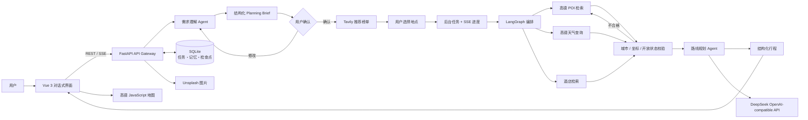

# TripMind AI 系统架构

## 关键设计

- 确定性数据节点负责 POI、天气、酒店与坐标校验，模型只负责需求理解、取舍和行程解释。
- LangGraph 保存节点状态并实现并行检索、条件回路、重试、人工确认与中断恢复。
- 规划任务在后台线程执行，浏览器通过 SSE 接收真实进度，不阻塞 FastAPI 请求线程。
- 长期旅行画像保存原始对话证据，只有用户审批后才参与后续规划。
- 生产镜像先构建 Vue，再由 FastAPI 同源托管前端，减少跨域和部署配置复杂度。

## 线上 Demo 部署

仓库根目录的 `render.yaml` 会创建一个 Docker Web Service。需要在 Render 中提供以下机密环境变量：

- `LLM_API_KEY`
- `AMAP_API_KEY`（高德 Web 服务 Key）
- `TAVILY_API_KEY`
- `UNSPLASH_ACCESS_KEY`
- `VITE_AMAP_WEB_JS_KEY`（高德 Web 端 JS Key，会按前端机制写入浏览器构建产物）
- `VITE_AMAP_SECURITY_JS_CODE`（高德安全密钥，需配置线上域名白名单）

免费实例使用临时文件系统，服务重启后 SQLite 任务、记忆和检查点会丢失。作品演示可以接受；正式产品应改接 PostgreSQL 或挂载持久磁盘。
